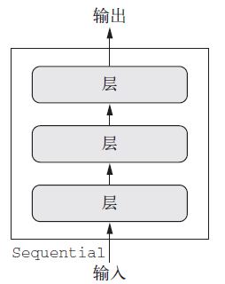

# model = Sequential()

keras中最常见的模型是Sequential序列模型，其特点是只有一个输入和输出，而且网络是层的线性堆叠。(各层之间是依次顺序的线性关系)

模型结构通过一个列表来制定,或逐层添加。

# Core
定义了常用层。
* Dense:全连接层
model.add(layers.Dense(128))

model.add(Dense(32, input_shape=(16,)))
如果是网络的第一层，需要指明输入的size。
* Activation：对一个层的输出添加激活函数
** model.add(layers.Dense(128,activation='relu'))

model.add(Activation('softmax'))
* Dropout:更新参数时随机断开一定百分比的输入神经元连接，防止过拟合
model.add(layers.Dence()),dropout=0.1
* Flatten:“压平”，将多维输入一维化，常用在卷积层到全连接层的过滤。
* Reshape: 将输入shape转换为特定的shape
# Convolution 卷积
* cropping 裁剪
* Upsampling 上采样
* Zeropadding 填充0
# Pooling 池化
# Recurrent 递归
* LSTM
* SimpleRNN
# Embedding
* Embedding层只能作为模型的第一层。将输入转换为具有固定大小的向量。
# Noise
* GaussianNoise 加性高斯噪声
* GaussianDropout 乘性高斯噪声